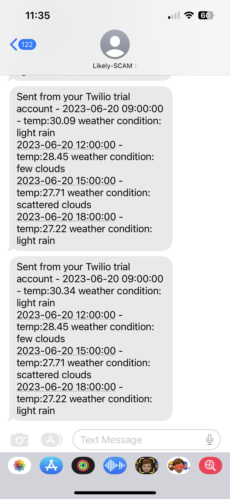
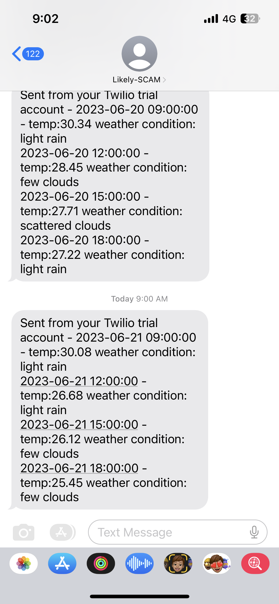

# day35_Weather condition notification

```python
import requests as re
from datetime import datetime
from twilio.rest import Client

END_POINT = "https://api.openweathermap.org/data/2.5/forecast"
API_KEY = "2ac1830acf8deff00d5030d74d713393"

parameter = {
    'lat': 1.352083,
    'lon': 103.819839,
    'appid': API_KEY,
    'units': 'metric'
}

respond = re.get(END_POINT,
                 params=parameter)
respond.raise_for_status()
data = respond.json()

curr_date = datetime.now().date()

next_12hrs_condition = []

morning_data = data["list"]
for weather_condition in morning_data:
    if weather_condition["dt_txt"].split(' ')[0] == str(curr_date):
        if weather_condition["dt_txt"].split(' ')[1] == '09:00:00' \
                or weather_condition["dt_txt"].split(' ')[1] =='12:00:00' \
                or weather_condition["dt_txt"].split(' ')[1] =='15:00:00' \
                or weather_condition["dt_txt"].split(' ')[1] =='18:00:00':
            next_12hrs_condition.append(weather_condition)

message_to_send = ""
for hours_condition in next_12hrs_condition:
    message_to_send += hours_condition['dt_txt'] + " - temp:" + str(hours_condition['main']['temp']) + " weather condition: " + hours_condition['weather'][0]['description']+"\n"

account_sid = "ACfc0eff52c849b7df45a5258d7580428a"
auth_token = "2344df66aae5a547ee019f3805cd5af0"
client = Client(account_sid, auth_token)
message = client.messages.create(
  body=message_to_send,
  from_="+14066292558",
  to="+6581892983"
)
print(message.status)
```

- Use API to get weather conditions from 9:00 to 18:00 in Singapore
- Deployed the python file in [www.pythonanywhere.com](http://www.pythonanywhere.com/) and scheduled to send an SMS notification every morning at 9 am.
- The SMS notification service provided by Twilio
- The code has already been modified based on the instructor’s code, as Openweather does not provide hourly weather forecasts update for a free account.
- The message looks like this below:



Weather forecast notifications sent out at 9:00 am next day 

