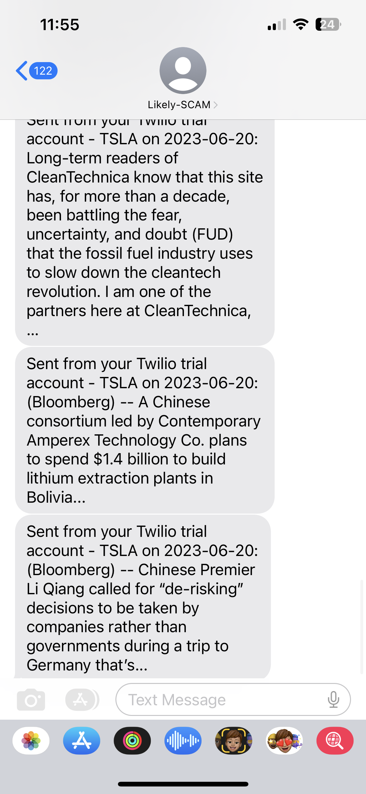

# day36_stock price change & news notification project

- Use API to get stock price and related news
- Send SMS message contain top 3 news to phone
- Send SMS message when stock price change more than 5% with top 1 related news

[Improved version](Improved%20version%200814e0dde0394a10a356d6cf6485b6b4.md)

```python
import requests as re
from datetime import *
from twilio.rest import Client

## STEP 1: Use https://www.alphavantage.co/documentation/#daily
# When stock price increase/decreases by 5% between yesterday and the day before yesterday then print("Get News").

# TODO 1. - Get yesterday's closing stock price. Hint: You can perform list comprehensions on Python dictionaries. e.g. [new_value for (key, value) in dictionary.items()]
STOCK_NAME = "TSLA"
STOCK_ENDPOINT = "https://www.alphavantage.co/query"
STOCK_API_KEY = "LPE7CB5WQ2EWQ4IJ"

stock_parameter = {
    'function': 'TIME_SERIES_INTRADAY',
    'symbol': STOCK_NAME,
    'interval': '60min',
    'apikey': STOCK_API_KEY,
    # 'outputsize': 'compact'
}

stock_respond = re.get(STOCK_ENDPOINT, stock_parameter)
stock_respond.raise_for_status()
stock_data = stock_respond.json()
print(stock_data)
stock_price = [value for (key, value) in stock_data['Time Series (60min)'].items() if min(key)]
print(stock_price)
yts_close_price = float(stock_price[0]['4. close'])
print(f'yesterday close price: {yts_close_price}')

# TODO 2. - Get the day before yesterday's closing stock price
day_before_yts_close_price = float(stock_price[1]['4. close'])
print(f'day before yesterday close price: {day_before_yts_close_price}')

# TODO 3. - Find the positive difference between 1 and 2. e.g. 40 - 20 = -20, but the positive difference is 20. Hint: https://www.w3schools.com/python/ref_func_abs.asp
stock_price_change = abs(yts_close_price - day_before_yts_close_price)
print(f'stock price change: {stock_price_change}')

# TODO 4. - Work out the percentage difference in price between closing price yesterday and closing price the day before yesterday.
stock_price_change_percentage = (yts_close_price - day_before_yts_close_price) / day_before_yts_close_price
print(f'%change of stock price: {stock_price_change_percentage}')

# #TODO 5. - If TODO4 percentage is greater than 5 then print("Get News").
# if stock_price_change_percentage >= 0.005:
#     print('Get News')

## STEP 2: https://newsapi.org/
# Instead of printing ("Get News"), actually get the first 3 news pieces for the COMPANY_NAME.

# TODO 6. - Instead of printing ("Get News"), use the News API to get articles related to the COMPANY_NAME.
COMPANY_NAME = "Tesla Inc"
NEWS_ENDPOINT = "https://newsapi.org/v2/everything"
NEWS_API_KEY = "18fc565d811e45cf9858e9c5665e42d5"
latest_date = [key for (key, value) in stock_data['Time Series (60min)'].items()][0]
latest_date = latest_date.split(' ')[0]
latest_date = datetime.strptime(latest_date, '%Y-%m-%d').date()
print(f'latest day: {latest_date}')

news_parameter = {
    'q': COMPANY_NAME,
    'from': latest_date,
    'sortBy': 'popularity',
    'apiKey': NEWS_API_KEY
}

news_respond = re.get(NEWS_ENDPOINT, news_parameter)
news_respond.raise_for_status()
news_data = news_respond.json()
print(f'news data: {news_data}')

# TODO 7. - Use Python slice operator to create a list that contains the first 3 articles. Hint: https://stackoverflow.com/questions/509211/understanding-slice-notation
news_article_top_3 = news_data['articles'][0:3]
print(f'top 3 news articles: {news_article_top_3}')

## STEP 3: Use twilio.com/docs/sms/quickstart/python
# to send a separate message with each article's title and description to your phone number.

# TODO 8. - Create a new list of the first 3 article's headline and description using list comprehension.
news_article_top_3_description = []
for article in news_article_top_3:
    for (key, value) in article.items():
        if key == 'description':
            news_article_top_3_description.append(value)

print(f'top 3 news articles description: {news_article_top_3_description}')

# TODO 9. - Send each article as a separate message via Twilio.
account_sid = "ACfc0eff52c849b7df45a5258d7580428a"
auth_token = "2344df66aae5a547ee019f3805cd5af0"
client = Client(account_sid, auth_token)

for article in news_article_top_3_description:
    message = client.messages.create(
        body=f'{STOCK_NAME} on {latest_date}:\n'
             f'{article}',
        from_="+14066292558",
        to="+6581892983"
    )
    print(message.status)

# Optional TODO: Format the message like this:
"""
TSLA: 🔺2%
Headline: Were Hedge Funds Right About Piling Into Tesla Inc. (TSLA)?. 
Brief: We at Insider Monkey have gone over 821 13F filings that hedge funds and prominent investors are required to file by the SEC The 13F filings show the funds' and investors' portfolio positions as of March 31st, near the height of the coronavirus market crash.
or
"TSLA: 🔻5%
Headline: Were Hedge Funds Right About Piling Into Tesla Inc. (TSLA)?. 
Brief: We at Insider Monkey have gone over 821 13F filings that hedge funds and prominent investors are required to file by the SEC The 13F filings show the funds' and investors' portfolio positions as of March 31st, near the height of the coronavirus market crash.
"""

if stock_price_change_percentage >= 0.005:
    if yts_close_price > day_before_yts_close_price:
        signal = "🔺"
        message = f'{STOCK_NAME}: {signal}{round(float((stock_price_change_percentage * 100)), 2)}% \n' \
                  f'Top related news: {news_article_top_3_description[0]}'
    elif yts_close_price < day_before_yts_close_price:
        signal = "🔻"
        message = f'{STOCK_NAME}: {signal}{round(float((stock_price_change_percentage * 100)), 2)}%\n' \
                  f'Top related news: {news_article_top_3_description[0]}'

    message = client.messages.create(
        body=message,
        from_="+14066292558",
        to="+6581892983"
    )
    print(message.status)
```

Sample message received: 

