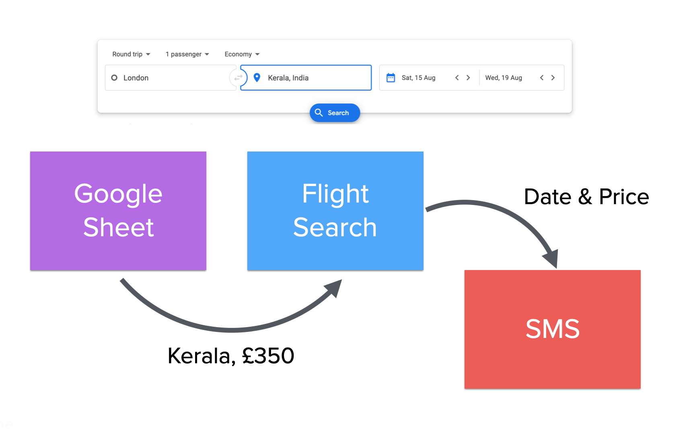
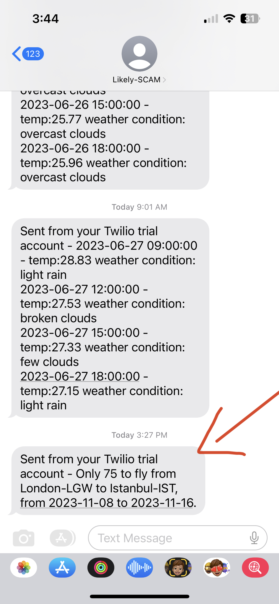

# day39_flight deal finder

[https://replit.com/@chenjinghao/day39flight-deal-finder](https://replit.com/@chenjinghao/day39flight-deal-finder)

1. Use the Flight Search and Sheety API to populate your own copy of the Google Sheet with [International Air Transport Association (IATA)](https://en.wikipedia.org/wiki/IATA_airport_code#Cities_with_multiple_airports) codes for each city. Most of the cities in the sheet include multiple airports, you want the city code (not the airport code see [here](https://en.wikipedia.org/wiki/IATA_airport_code#Cities_with_multiple_commercial_airports)).
2. Use the Flight Search API to check for the cheapest flights from tomorrow to 6 months later for all the cities in the Google Sheet.
3. If the price is lower than the lowest price listed in the Google Sheet then send an SMS to your own number with the Twilio API.
4. The SMS should include the departure airport IATA code, destination airport IATA code, departure city, destination city, flight price and flight dates. e.g.

Use API from Sheety, Twilio, Tequila

Sheety → watchlist for cities you want to visit

Twilio → send a notification when a good deal found

Tequila → retrieve flight data

SMS received: 

