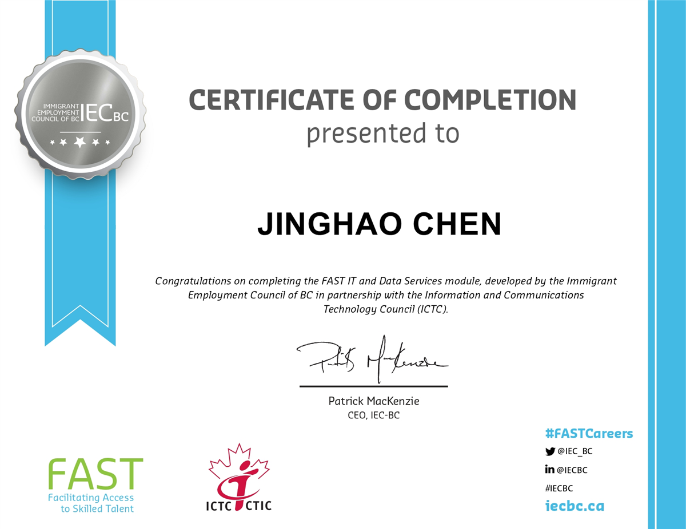
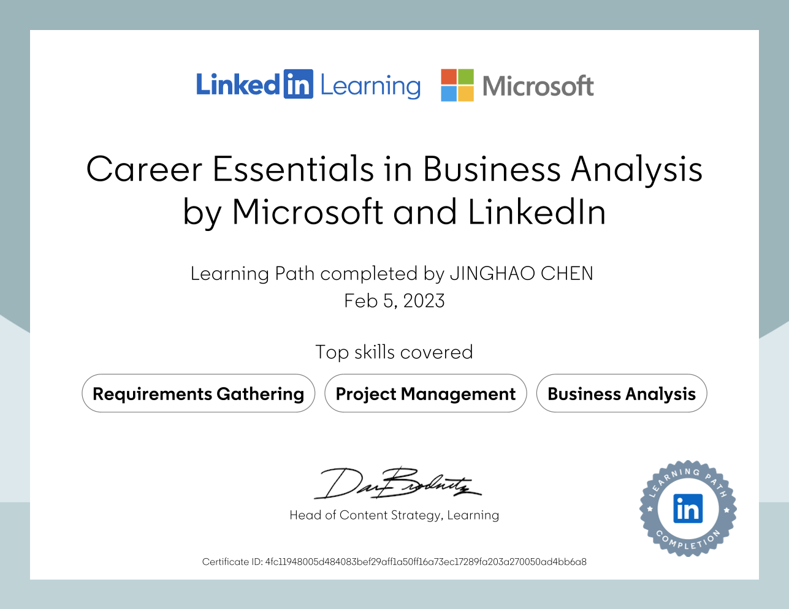
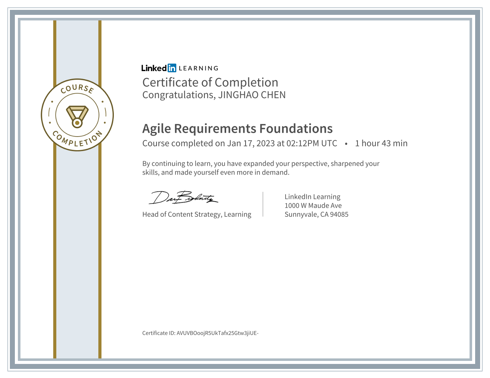
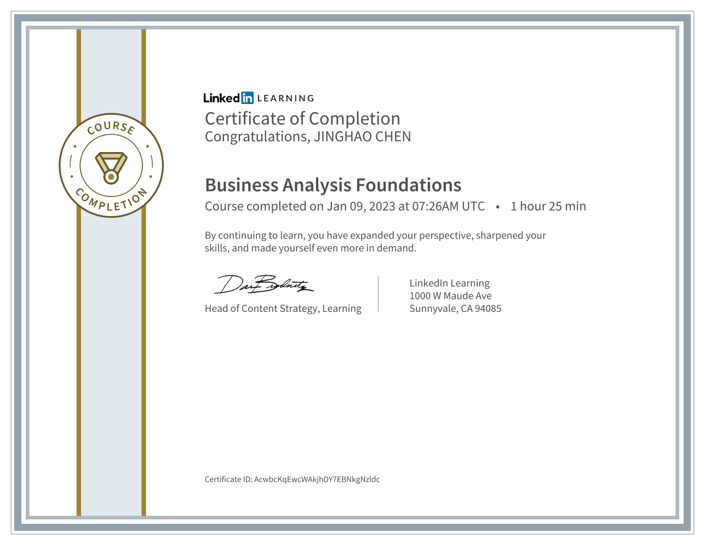
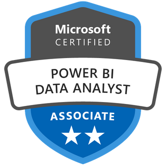

# my Education

### Leet code badge

[jinghao_chen - LeetCode Profile](https://leetcode.com/jinghao_chen/)

### Education

- Bachelor of International and Global Studies (Jun 2012 - Jun 2015)
    
    
    
- [on-going] Post-Degree Diploma in Data Analytics (Jan 2024 - May 2025)

### Certifications

- Introducing Generative AI with AWS (Sep 2024)
    
    [Introducing Generative AI with AWS _ Udacity.pdf](Introducing_Generative_AI_with_AWS___Udacity.pdf)
    
- FAST IT and Data Service module (Sep 2014)
    
    
    
- NUS Fintech SG Programme (Mar 2022 - Dec 2022)
    
    [NUS Fintech.pdf](NUS_Fintech.pdf)
    
    Check out all my credentials from this program below: 
    
    [CHEN JINGHAO's Credentials wallet * Accredible * Certificates, Badges and Blockchain](https://credentials.nus.edu.sg/profile/chenjinghao210306/wallet)
    
- Career Essentials in Business Analysis by Microsoft and LinkedIn (Feb 2023)
    
    
    
    [Certificate of Completion](https://www.linkedin.com/learning/certificates/4fc11948005d484083bef29aff1a50ff16a73ec17289fa203a270050ad4bb6a8)
    
    - Agile Requirements Foundations
        
        
        
    - Business Analysis Foundations
        
        
        
    - Business Benefits Realization Foundations
        
        [CertificateOfCompletion_Business Benefits Realization Foundations.pdf](CertificateOfCompletion_Business_Benefits_Realization_Foundations.pdf)
        
    - Requirements Elicitation and Analysis
        
        [CertificateOfCompletion_Requirements Elicitation and Analysis.pdf](CertificateOfCompletion_Requirements_Elicitation_and_Analysis.pdf)
        
    - Business Analysis Foundations: Business Process Modeling
        
        [CertificateOfCompletion_Business Analysis Foundations Business Process Modeling.pdf](CertificateOfCompletion_Business_Analysis_Foundations_Business_Process_Modeling.pdf)
        
    - Requirements Elicitation for Business Analysts: Interviews
        
        [CertificateOfCompletion_Requirements Elicitation for Business Analysts Interviews.pdf](CertificateOfCompletion_Requirements_Elicitation_for_Business_Analysts_Interviews.pdf)
        
    - Business Analyst and Project Manager Collaboration
        
        [CertificateOfCompletion_Business Analyst and Project Manager Collaboration.pdf](CertificateOfCompletion_Business_Analyst_and_Project_Manager_Collaboration.pdf)
        
    - Project Management Foundations: Requirements
        
        [CertificateOfCompletion_Project Management Foundations Requirements.pdf](CertificateOfCompletion_Project_Management_Foundations_Requirements.pdf)
        
    - Managing Projects with Microsoft 365
        
        [CertificateOfCompletion_Managing Projects with Microsoft 365.pdf](CertificateOfCompletion_Managing_Projects_with_Microsoft_365.pdf)
        
    - Learning Data Science: Understanding the Basics
        
        [CertificateOfCompletion_Learning Data Science Understanding the Basics.pdf](CertificateOfCompletion_Learning_Data_Science_Understanding_the_Basics.pdf)
        
    - Managing Data with Microsoft 365
        
        [CertificateOfCompletion_Managing Data with Microsoft 365.pdf](CertificateOfCompletion_Managing_Data_with_Microsoft_365.pdf)
        
- Creative Thinking: Techniques and Tools for Success offered by ImperialX (Jun 2022)
    
    [ImperialX CTT102 Certificate | edX](https://courses.edx.org/certificates/deb50055e69a46439ecc6875fe7e5f9a)
    
    [ImperialX CTT102 Certificate _ edX.pdf](ImperialX_CTT102_Certificate___edX.pdf)
    
- Applied Scrum for Agile Project Management offered by USMx (Aug 2022)
    
    [USMx ENCE607.1x Certificate | edX](https://courses.edx.org/certificates/c084ccd473a0468f99c5fa8eb1be879f)
    
    [USMx ENCE607.1x Certificate _ edX.pdf](USMx_ENCE607.1x_Certificate___edX.pdf)
    
- Microsoft Certified: Power BI Data Analyst Associate
    
    [Microsoft Certified: Power BI Data Analyst Associate was issued by Microsoft to JINGHAO CHEN.](https://www.credly.com/badges/48848384-3934-4c58-a634-583d8857f337/linked_in_profile)
    
    
    
- Google Data Analytics is offered by Google (Dec 2022)
    
    [Completion Certificate for Google Data Analytics](https://coursera.org/share/47fe2e287c6bbc4920ddfff42cd600a9)
    
    [google data analytics.pdf](google_data_analytics.pdf)
    
- CS50's Computer Science for Business Professionals offered by HarvardX (Jun 2022)
    
    [HarvardX CS50B Certificate | edX](https://courses.edx.org/certificates/2f9b290c4ba043659d454f06b9250b0f)
    
    [CS50's Computer Science for Business.pdf](CS50s_Computer_Science_for_Business.pdf)
    
- Programming for Everybody (Getting Started with Python) offered by MichiganX (Jun 2022)
    
    [MichiganX py4e101x Certificate | edX](https://courses.edx.org/certificates/c117cc8148d5471aba005f5d1dc2daed)
    
    [MichiganX py4e101x Certificate _ edX.pdf](MichiganX_py4e101x_Certificate___edX.pdf)
    
- Learn SQL Basics for Data Science
    - SQL for Data Science (1 of 4)
        
        [SQL for Data Science.pdf](SQL_for_Data_Science.pdf)
        
    - Data Wrangling, Analysis and AB Testing with SQL (2 of 4)
        
        [Data Wrangling, Analysis and AB Testing with SQL.pdf](Data_Wrangling_Analysis_and_AB_Testing_with_SQL.pdf)
        
    - Distributed Computing with Spark SQL (3 of 4)
        
        [Distributed Computing with Spark SQL.pdf](Distributed_Computing_with_Spark_SQL.pdf)
        
- Excel Skills for Data Analytics and Visualization (Nov 2022)
    
    [Completion Certificate for Excel Skills for Data Analytics and Visualization](https://coursera.org/share/562a054e096a4084b76b254eb8babdf5)
    
    [Excel Skills for Data Analytics and Visualization.pdf](Excel_Skills_for_Data_Analytics_and_Visualization.pdf)
    
- JavaScript Introduction offered by W3Cx (Aug 2022)
    
    [W3Cx JS.0x Certificate | edX](https://courses.edx.org/certificates/f597f5de0bd448e49431026f0501ee11)
    
    [W3Cx JS.0x Certificate _ edX.pdf](W3Cx_JS.0x_Certificate___edX.pdf)